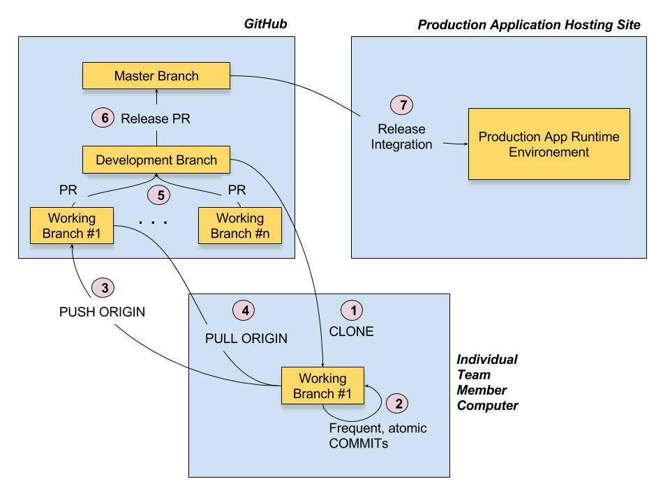

# Development Workflow

To manage and coordinate multiple pull requests the team will use three types of branches
* Master: This is the main branch that always reflects the current production release. This branch will only be update from the development branch pull requests
* Development: Reflects the code for the next release. This branch will be updated from working branch pull requests. 
* Working branches: Each developer working on changes or fixing bugs must create a working branch off the development branch for those changes. When completed the developer must create a pull request into the development branch.
* For each pull request into either the development branch or master branch the code must be tested adequately before merging to prevent corrupting the code base.
* Once a group of features is ready to be promoted to production, a pull request into the master branch from the development branch should be made.

# Tech Stack
