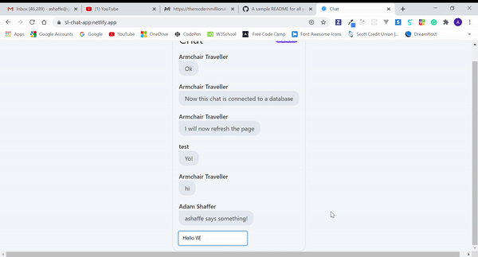

# Serverless Chat

💬 **[Chat App](https://sl-chat-app.netlify.app/)** | Voyage-22 | https://chingu.io/

### A chat web app to provide real-time communication between multiple users via messages, powered by Serverless tech!

  
  

## Features

⚡ Serverless functionality w/ Netlify Functions

⚡ Login & auth w/ Netlify Identity

⚡ Realtime chat & managed websockets w/ Pusher

⚡ Chat history backed by FaunaDB

**[See it live!](https://sl-chat-app.netlify.app/)**

## The 🦎 Team

**[Adam Shaffer](https://github.com/GreatDeveloper66)**, **[Armchair Traveller](https://github.com/armchair-traveller)**, **[David](https://github.com/dmedford)**, and **Kevin F**.

## Technologies Used

**Web Framework:** [Svelte](https://svelte.dev/)

- Next generation component framework that is touted as the "un-framework" as its magic is done during compile-time. By generating standard run-of-the-mill JavaScript from framework specific syntax, it can selectively produce code that it needs to run, and no further. This results in low bundle sizes and performant applications for little cost, while maintaining a great developer experience. Its declarative syntax closely resembles vanilla JavaScript plus a large variety of shorthand conveniences, but without the extra mental overhead of manually writing every DOM manipulation.

**App Framework:** [Sapper](https://sapper.svelte.dev/)

- A Svelte web application framework that's small and performant just like Svelte, heavily inspired by Next.js.

**Database**: [FaunaDB](https://fauna.com/)

- Offers a database for Serverless applications that does not require worrying about latency, provisioning, scale, or database correctness. On top of that, it is ACID compliant. Because of these reasons it is simple, reliable, and productive to work in. Built-in GraphQL support.

**Realtime:** [Pusher Channels](https://pusher.com/channels)

- Offers managed websocket connections, and fallbacks in the cases where websockets aren't available. It can do pretty much everything you'd want live like collaboration/activity feeds and messaging. Dating all the way back from 2011, their reliability is no small feat.

**Deployment:** [Netlify](https://www.netlify.com/)

- The golden standard for JAM (JavaScript, APIs, and Markup) stack app hosting. Has a myriad of features built-in without need for configuration like CI/CD, plugins, CDN, and much more. Essentially an entire platform with its ability to easily add dynamic functionality like user identity, Serverless functions, forms, analytics... the list goes on and on. Simply link to a repo and start developing!

## How to Deploy

  
<strong>These instructions allow you to deploy your very own instance of this chat app</strong>

  1. Clone the repo and deploy it to Netlify. See [how to create deploys](https://docs.netlify.com/site-deploys/create-deploys/#deploy-with-git).
  2. In your app's Netlify dashboard, [Enable Identity](https://docs.netlify.com/visitor-access/identity/#enable-identity-in-the-ui). 
      - **Note that** you can enable any extra login integrations you want here through *Settings and usage*, e.g. GitHub or Google login options
  3. Next, setup a new database with [FaunaDB](https://fauna.com/). Take note of the database's given secret/key because you'll need it later! 
  4. Inside the database's UI, click the GRAPHQL tab and upload `schema.gql` from the root of your app's repo. This prepares the database to accept your app's messages!
  5. Now, setup realtime with [Pusher](https://pusher.com/) by creating a new Channels app through your dashboard. Make sure you select `us3` as your cluster because you can't change this later!
  6. In your Pusher app's dashboard, go to the App Keys tab and take note the values for `app_id`, `key`, and `secret` because we'll need it soon! 
      - For those concerned with security implications of these values, only the `secret` should be kept strictly confidential, never reveal it to clients.
  7. In your app's repo, add your Pusher key value (not the secret!) by modifying `PUSHER_KEY`'s value in `src/utils/Pusher.js`. This will allow clients to subscribe to your chat's channel. Commit the change.
  8. In your app's Netlify dashboard, go to **Site settings > Build & Deploy > Environment**. Add the environment variable values noted before as:
      - `FAUNA_SECRET`
      - `PUSHER_APP_ID`
      - `PUSHER_KEY`
      - `PUSHER_SECRET`
  9. Finally, head to **Deploys** and trigger a deploy.
  
  Serverless functions are already enabled and configured through the `netlify.toml` config. There's nothing you need to do here.

  Congrats, you now have your own Serverless chat app! 🥳 Your secret keys are protected through Serverless functions and there aren't any servers you need to manage! All of this remains in generous free tiers.
  

## Development

For development, you'll need to [install the Netlify CLI](https://docs.netlify.com/cli/get-started/#installation) for the Serverless functions to work locally.

Once installed, run `npm i` in your app's root directory to install dependencies. To initialize the environment variables you have two options...

**Option 1: Login method** (for main contributor or solo teams, fastest) - `ntl link` to link to your site. Select your current git remote origin for ease of linking. Environment variables will automatically be obtained from the site and you'll be able to develop on your machine.

**Option 2: `.env` method** (for additional team members) - Create a `.env` file in your app's root directory and add in the environment variables obtained from the deploy instructions. **Make sure not to commit this to the repo**, there's a `.gitignore` to ignore it but it's crucial to understand secrets should not be shown in the codebase.

**Note**: When developing locally, you cannot use Oauth (external providers) like GitHub to test. Only traditional email and password login will work. See [this issue](https://github.com/netlify/netlify-identity-widget/issues/86) for more details.

After following either option, run `ntl dev` and you're ready to go. You will still need a network connection. Uncomment `username = "dev_env"` in `src/components/Chat.svelte` to test chat functionalities without logging in.

## Contributing

Pull requests are welcome. For major changes, please open an issue first to discuss what you would like to change.

## License

[MIT](https://choosealicense.com/licenses/mit/)
